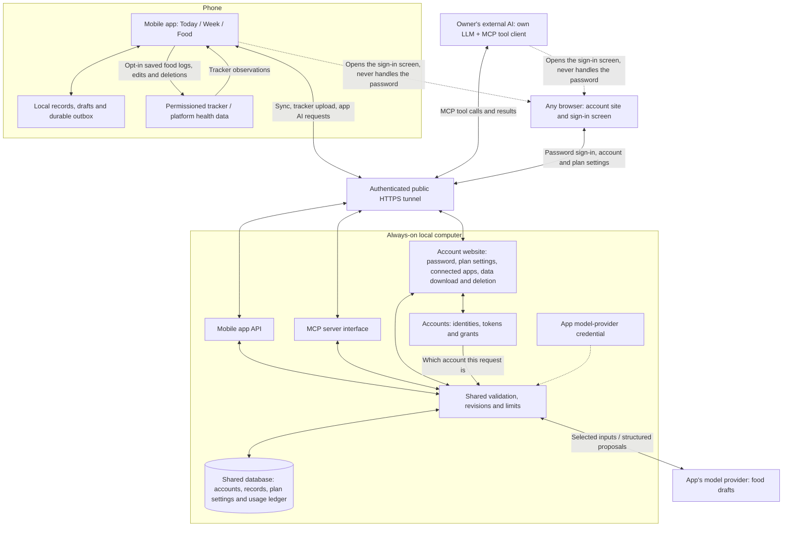

# Your training companion

## Weekly wrap-up removed — November 15, 2026

The AI weekly wrap-up is not part of this product. Today has no Sunday review card; Week's date range is a noninteractive label with previous/next arrows. The Week agenda, logging, workout HR recaps and weight entry/chart remain available. No Generate, Refresh or saved AI summary screen is present. Sunday uses the ordinary morning-plan reminder at its existing 9 AM time; old review notification links open Week.

There is no weekly-review API, MCP tool, model configuration or background generation service. Upgrade compatibility completes previously queued phone workers without network/model calls. Historical review caches and server job rows remain inert; removing this feature does not delete activity, food, weight, tracker or sync records. No replacement coaching feature is implied.

Acceptance: no review entry points on Today/Week; week navigation still works; retired routes return 404 and MCP does not advertise review_week; queued legacy workers cannot generate; food interpretation/cache, local reminder jokes and ordinary sync retain their existing behavior. Do not restore review generation from an older design.

## A technology-agnostic implementation blueprint and AI build recipe

Edition: November 16, 2026. Based on the implemented Euros personal training app, with identifying information and personal records removed.

**Give this entire document to your own coding AI.** It describes what to recreate, which choices to personalize, and how to verify the result. Your AI chooses the language, framework, database, model provider, operating system integration, deployment tools, and tunnel provider. Nothing here requires a particular vendor or programming stack.

The companion HTML edition includes reference layouts. Both editions contain the same specification; the HTML adds visual sketches, not another set of requirements. Illustrative dates, foods, exercise prescriptions and numbers are fictional UI fixtures, never a recommended diet or training program.

## 1. What you are building

A private app for preparing for a specific training goal or competition—for example, a Brazilian jiu-jitsu tournament. One installation can hold several people's accounts, and no account sees another's training (see *Accounts, sign-in and the plan a user sets*). The goal and its target date organize the training phases, weekly schedule, recovery routines and nutrition plan. The app turns that preparation into concrete daily actions and makes progress toward the goal visible.

It answers three questions: what should I do next, what have I logged, and how is my training week going? It combines a dated training plan, recovery actions, food intake and meal plans, tracker workout recaps and a small animal companion. Personalize it around the recipient’s own goal, whether that is a BJJ competition, another sporting event, or a defined training milestone.

The phone is the everyday interface. A backend on an always-on local computer provides durable shared storage and AI requests. An authenticated public HTTPS tunnel makes it accessible away from home and to the owner's external AI. The external AI can read the plan and logs, help with meals or shopping, and make explicitly requested changes through a model-facing tool interface such as MCP.

The app follows an existing plan; it is not an autonomous coach. A user sets the shape of their own plan — event and date, calorie goals, meals, weekly training days — on the account website; session-level prescriptions and plan revisions come from conversations with the owner's AI or coding sessions outside the app. No social feed, coach-managed rosters or shared training groups, technique journal, calorie reward for exercise, generic readiness score, or in-app shopping system.

### Current scope versus future ideas

Recreate now: Today, Week, Food, activity details, recovery steps, food interpretation/review/save, weight observations, reminders, settings, durable offline records, authenticated synchronization, saved meal plans available to agents, tracker HR recaps and agent-readable workouts, and mascot moods.

Not part of the current baseline: natural-language manual workout interpretation, automatic workout categorization by an LLM, generated in-app workout narratives, sleep tracking, an in-app editor for session prescriptions, pantry/leftover accounting, automatic shopping messages, advanced post-session arrival-relative notifications. Natural-language manual workout logging was explicitly removed from scope. Other deferred features may be proposed later; do not implement them simply because an early design implies them.

Author each recipient’s plan only through their confirmed horizon. An external-app placeholder is incomplete prescription data; replace it with an explicitly authorized routine before expecting exercise-level display or progression. Do not copy the source owner’s schedule or silently repeat a phase forever.

## 2. Personalize before building

Ask the owner for the following in small groups. Record answers in a human-readable personal configuration. Distinguish confirmed facts, proposed defaults, and unresolved values. Use null for unknown quantities, not zero.

| Input | What to establish |
| --- | --- |
| Device and access | Phone platform, local computer, whether it stays awake, external AI clients, and who will maintain it. |
| Accounts | Who may have an account, whether visitors can create their own, who holds the operator commands, and whose model budget the accounts spend. |
| Event | App name, event name and date, or an agreed alternate home heading if no event. |
| Time and units | Home time zone, week start, body-weight unit, food and nutrient units, clock format. |
| Training | Dated phases, weekly days/times, session intent, exercise prescriptions, rest days, and any confirmed durations. |
| Recovery | The actual actions the owner wants, timing, hydration action, and any already-established supplement details. Do not invent doses. |
| Nutrition | Owner-selected calorie/protein/carbohydrate/fat targets, preferences, restrictions, meal timing, and two optional reference meal days. |
| Weight | Whether to use it, observation day, known baseline/goal, and whether maintenance targets are established. |
| Trackers | Which sources supply workouts, HR, walks and weight; available permissions; how source sport labels map to the owner's activities. |
| AI | Preferred provider, a capable low-cost food model, private provisioning method, and acceptable request allowances. |
| Visuals | Accent color, animal character, event clothing/accessories, and whether mildly judgy expressions are welcome. |
| Reminders | OS permission, quiet hours, and code/data-authored times/types. |

Do not ask the owner to choose databases, web servers, frameworks, or deployment products unless they have a preference. The building AI should inspect the available environment, select a maintainable stack, and explain its choice briefly.

Configure calorie tiers for planned recovery, short strength, one sport session and multiple sessions. Save each dated target with the schedule used to author it. Changes prompt agent review, never automatic calorie reductions or exercise eat-back. Configure a consecutive-day average weight threshold and a maintenance calorie increment; use one observed reading per local day, ignore future data, preserve missing days, and recompute after corrections/deletions. Maintain historical policy boundaries. Later weight increases do not automatically revert an established maintenance transition. These are planning estimates, not measured energy requirements.

If meal planning is requested, author concrete breakfast, lunch, dinner and recovery-snack examples using the owner's targets. Optionally alternate two reference days over the next confirmed week. Persist each dated plan; do not leave it as chat text. Keep generic food calculations and brand/preparation uncertainty separate from the user's actual intake.

## 3. Product rules that should survive personalization

1. Only three primary destinations: **Today / Week / Food**. Settings is secondary. There is no History or Week So Far tab.
2. All plan items have actual dates and times. Logging is allowed at any time. A late item is unknown, not automatically missed or skipped.
3. Planned work, performed activity, consumed food and imported tracker records are different concepts. Never turn one into another silently.
4. Exercise checkmarks commit Done with Undo; other quick-log icons open details. Tapping the row itself opens details without completing it.
5. Completion and skip are explicit, reversible outcomes. Record the actual outcome time separately from the scheduled time.
6. Missing information stays unknown. A missing food day is not zero intake; a missing HR interval is not rest.
7. Food interpretation creates an editable draft. Only explicit save creates or changes intake.
8. Use concise functional copy. No motivational slogans, explanatory filler, or implementation requirements disguised as interface labels.
9. Plan adjustments and shopping workflows live outside the app. The app shows the accepted plan and records observations.
10. Personal health/nutrition choices come from the owner. The building AI must not import another person's targets, doses, event, schedule, measurements or credentials.

## 4. Visual system and navigation

White background; near-black text; one clear accent color, blue by default; pale accent panels; fine neutral separators. Avoid a dense dashboard full of nested cards. Use a clean system sans-serif, strong numeric hierarchy, modest rounded corners and generous whitespace around primary actions.

Reference tokens: ink #10151E, secondary text #535F70, divider #D9E0E9, blue #2465DA, pale blue #EDF3FF. Typical hierarchy: 28–30 headline, 19 section title, 14–15 body, 11–12 supporting text in platform-scaled units. Adapt these to the platform and accessibility settings rather than hard-coding a fixed phone size. Interactive areas should be about 48 device-independent units or larger.

The mascot sits beside the countdown heading, not in a separate banner. Allocate roughly a quarter of the header width and enough height for the complete animal; do not shrink it into a barely visible icon. Use a custom animal with readable silhouettes and transparent backgrounds. A weasel in a martial-arts uniform is the source design, but the recipient should choose their own character.

Use category icons: martial arts for mat training, weights for strength, utensils for food, and recovery/rest imagery for recovery. Pending exercise: blue check action; pending other logs: blue pen. Done: filled blue check. Skipped: muted minus. Partial routine: distinct partial-state shape. Provide accessible names and state descriptions; color alone is insufficient. Do not print “Not logged” next to every row.

Details close with **×** and return to the originating screen/date. System back should behave consistently and preserve drafts. Log/Skip controls near the top of activity details should be balanced and centered, not stranded in one corner. Move is a small secondary action beside the time, not the main action. Food entry has its own action pattern below.

Support large text, scrolling, keyboard overlap, reduced motion and screen readers. Do not clip labels, charts or primary actions on narrow displays. At larger text sizes put the countdown above the complete mascot, giving the number full width; ordinary text keeps the side-by-side composition. Reserve a full touch target beside wrapping activity dates for Move, and wrap the detail action buttons when needed. Weight and heart-rate summary columns share the available width. Announce activity completion state and both the displayed Food date and the date control’s return-to-today action.

If a tracker detail cannot read its cached data, keep Close available and show a concrete instruction to refresh health access in Settings. Retry the read when the imported snapshot changes. An unsuccessful unlink must report failure without claiming the link was removed. These presentation and failure states never alter recorded completion or measurements.

## 5. Screen-by-screen specification

### Today

Heading: “91 days to [event]” using the real local-date difference, not “Today.” Agree on event-day/past-event wording rather than showing nonsensical negative countdowns. Place the mascot alongside it and a small settings affordance nearby.

Home omits the nutrition summary; the Food tab retains a blue consumed/target summary with its pencil entry action.

List all of today’s unresolved activities/steps in scheduled-time order under a neutral divider. Once today is resolved, show the next unresolved future day under **Tomorrow** or the scheduled weekday. Morning means actions such as breakfast, hydration or stretching, not a sleep survey. If the item is a routine, show its independently loggable steps. Include enough detail to act without opening every row: food/portion instructions, exercise prescriptions or step durations where known. Exercise uses Done; other activities open logging details.

Keep each activity identity and action; do not split today into an additional Later today section. As items resolve, the agenda advances. Scheduled rest still has its recovery actions; do not replace them with “no training planned.” A compact imported walking summary can provide daily movement context without awarding exercise calories or marking training complete.

### Week

Previous/next week controls; seven dated, expandable groups. Open the current date by default when viewing the current week. Show actual plan items, including rest, recovery children and the weekly weigh-in.

Collapsed groups summarize the plan and list imported workouts by name and a concise intensity word where enough evidence exists—for example, “BJJ · Moderate.” Do not substitute “1 tracker workout.” Expanded groups show scheduled rows and unlinked imported workouts. Each workout opens its measured recap. Once linked to a planned session, do not list/count it again as a separate unlinked workout.

Opening Week or returning from another tab must retain already loaded workout names and intensity labels. Read the locally persisted tracker snapshot without waiting for network sync; derive summaries once per changed snapshot off the UI thread, retain them across navigation, and update them when imports, corrections, deletions or workout links change. Do not reset the list to empty and rebuild every heart-rate recap on each visit. Cold launch may briefly load local data; tab switching should reuse it.

Time controls use 12-hour display with explicit AM/PM, including session Move, food-entry details, and reminder settings. Tapping the time opens a 12-hour picker; cancelling preserves the current value. Confirming selects the time in the current form; moving a session still requires its Move action, and food changes still require saving the entry. Store unambiguous local time and retain the date/time-zone rules, including midnight and noon.

Moving a session retains its identity and outcome history. Move unfinished attached recovery steps by the same intended offset once; preserve completed step timing. Do not invent additional sessions as debt.

The date-range heading is a label; previous/next arrows navigate weeks.

### Food overview

Date controls, a prominent calorie/protein/carbohydrate/fat progress widget, and one right-aligned food-entry icon. No redundant “Food” or “Eaten so far” heading inside the screen.

Show recorded food entries for that day with useful totals and an edit path. Directly beneath the totals, show remaining planned meals and foods/portions without a Keep eating heading. Include dinner. There is no log button beside every planned meal. A meal plan is a suggestion for later intake, not a consumed-food record. Use a versioned meal-template library with food/preparation state, gram portions and nutrient-source snapshots; compose dated meals around the accepted training schedule. Materialize dated records through the planning horizon so external agents can read and edit them. Only fill missing IDs; existing custom days and deletion tombstones win. Preserve stable meal IDs and meal-time exceptions. Extending the horizon never overwrites agent edits or logs food. Maintenance adds the configured increment to each accepted planned-day tier. Portion changes for maintenance remain an explicit meal-plan edit.

Swipe a planned meal in either direction to dismiss it from the remaining planned meals for the selected date. The row disappears after the dismissal is saved; a brief “Breakfast dismissed” message offers **Undo**. An unobtrusive restore icon above the remaining meals remains available while any planned meals are dismissed and restores all dismissed meals for that date. Provide the equivalent named dismiss action to screen readers. The gesture must coexist with vertical scrolling. If saving fails, retain the row and show a short retryable error; if restoration fails, retain its prior state. With no meals left, show “No remaining meals planned.”

Dismissal is independent of food logging: it creates no intake, nutrient totals, completion/skip outcome, or plan edit, and never changes mascot mood. Preserve it across app restart and offline use, keyed by date and stable meal ID; tomorrow’s breakfast stays visible. Current dismissal state is device-local presentation state, so it is not shared through the backend/MCP but is included in the portable local-state backup. Food correction/deletion does not undo a manual dismissal.

Link an intake entry to a planned meal only when explicitly selected or preserved from the entry flow. Current behavior hides that linked meal from the remaining list; unlinked food does not guess which meal it fulfilled. Corrections/deletion must update the list and totals. Plan changes do not rewrite already consumed food.

No shopping list, pantry UI or meal-plan editor. Agents can read/update saved meal plans outside the app.

### Food entry and review

Top row: **×** left; **Add** right. A text area accepts ordinary food descriptions, including weights, brands, preparation and corrections. No top Log or Skip, no “include weights” subtitle, no “calculate calories and macros” label.

Add requests interpretation and presents one editable aggregate draft: the original description, known mass, calories and macros, plus a concise clarification only when necessary. The current product does not require a detailed per-ingredient ledger or a nutrition database integration. A model may use typical values when reasonable; supplied label values and measured quantities take precedence. Avoid repeating “estimated” as UI clutter; retain interpretation provenance internally.

Offer manual details/totals, date/time and optional planned-meal association. Blank nutrients stay unknown. Validate units and numeric ranges. Once reviewed, provide one final save-check action aligned right. Save a new entry once; editing an existing entry replaces it once. Support explicit delete with confirmation. Close, process restart, network failure and late AI responses must not lose text or unexpectedly save intake.

### Mat-training session and imported workout

Planned-session detail has Log/Skip near the top and secondary scheduled-time/Move controls. The main content is a measured tracker recap, not a technique form: duration, actual start/end, average/peak HR, HR curve, coverage, and compact zone bars with durations. No title saying “Estimated time in zones.” Missing intervals remain gaps; absent data does not produce a synthetic curve.

Provide explicit choose-workout/link/unlink for ambiguous matching. Linking does not fabricate completion. Do not track “first grip → takedown → top control,” tactics or technique notes. An imported-only recap does not need redundant plan completion controls.

Manual natural-language workout logging is outside scope; do not add it from an older design.

### Strength session

Read-only prescribed exercises with available sets, reps, holds or loads; **Done / Skipped** controls. Done opens the three-choice session-feedback flow described below. No detailed set-by-set performance form. Unspecified loads or sets remain absent rather than invented. Show the saved plan without generic filler.

### Recovery and rest

A routine contains independently loggable steps. Each has its concrete action and known duration. Parent progress derives from the children: all done, all skipped, mixed/partial, or pending. One completed child does not complete the entire routine.

Hydration is an action such as “12–20 oz of water,” personalized to the owner's chosen instruction, with Log/Skip. Do not ask for a consumed amount or infer an exact volume from completion. Supplements, if enabled, require the owner's product and actual dose; do not invent or activate unspecified doses. No sleep form or ambiguous “evening times” screen.

### Weight

Weight entry is an explicit observation with unit, time and optional context. Allow manual entry or selection of an eligible imported measured weight. Profile settings on a tracker are not measured body weight. Prevent duplicate imported selections. Support correction/deletion and a selected weekly observation.

The weight chart shows valid observed measurements and a trailing seven-calendar-day trend of daily means, with one vote per observed day. Omit missing days, require at least two observed days for a trend value, and do not connect gaps of seven days or more. Display the latest measurement/trend with dates and measurement count; keep no-data states explicit. This chart is separate from maintenance’s seven consecutive days using the earliest daily reading. No generated weekly narrative is attached to the chart.

Home exposes an icon-only **Sync Health Connect** action beside the Settings gear, without an outline. It reads permitted tracker data, shows progress, prevents repeat taps during a read, and reports success or permission/failure guidance in a snackbar. Permission/source management and data removal remain in Settings. A refresh does not complete planned activities.

### Settings and reminders

Reminders speak in the mascot's voice: conversational, specific, occasional animal puns or light teasing, without motivational filler. Deterministic code builds factual sentences from actual plans and explicit logs. The app appends a line from a static catalog kept with the app, one list per reminder kind with several lines each, chosen at random at delivery and avoiding recently used lines. Write lines about the mascot or the moment rather than claims about the user, so any line fits any reminder of its kind. Missing logs never become accusations of skipping. No weight/food shaming or pressure to train through injury. A fixed list needs no model: random local selection is cheaper, works offline and never waits on the network.

Settings groups: synchronization, tracker access/refresh, notification preferences, goal information, nutrition targets, and data export/restore. Keep connection diagnostics secondary to ordinary use. Separate Disconnect, clear local tracker cache, and delete a real record.

Reminders are opt-in, with the existing user's preferences preserved during upgrades. Defaults: morning overview at 8:00 AM, training preparation 60 minutes before a session, recovery 15 minutes after a linked tracker's actual end (otherwise only after an explicitly configured duration), and a single food check-in at 7:30 PM only if no food entries are saved for that local date. Sunday morning plan at 9:00 AM replaces ordinary morning. Morning includes concrete planned meals, training times and recovery steps on rest days. Food mentions only currently visible meal suggestions, without asserting that they were not eaten. Explicit prior-day skip references disappear after subsequent completion. No per-step or per-meal nagging.

Open routes to Today, the session/recovery detail, food entry or Week. Snooze 30 minutes is a notification action; a second action opens 10/30/60 minutes and a custom AM/PM picker. An earlier chosen clock time means tomorrow, within 24 hours. Reject quiet-hour snoozes with an explanation. Daily overview, food and Sunday morning-plan snoozes stay on their original date; the chooser rejects a next-day time for these. Training and recovery snoozes may cross midnight within 24 hours, retaining the original activity. Dismiss closes only the notification; no action silently records completion or changes scheduled activities. Announce action labels for accessibility and keep the useful fact first in collapsed notifications.

Keep one alarm per stable reminder identity; persist scheduling/snoozes locally. Reconcile moves, completion, tracker-link changes, meal dismissals, reboot and clock changes. Re-read eligibility and facts at delivery. Cancel already-visible notifications when facts change; do not re-notify just because text changed. Quiet-hour non-overview prompts are dropped, while the next overview describes current plans. Shift the overview to quiet-hours end only within the same date. Drop very late callbacks rather than producing catch-up bursts. Schedule a rolling horizon and replenish after delivery and synchronization. Permission denial leaves in-app tasks available; platform delivery is approximate. Dated prep activities support local notifications. External shopping/message delivery remains disabled until configured.

## 6. Architecture without a prescribed stack

### System diagram

```mermaid
flowchart TB
    subgraph phone["Phone"]
        mobile["Mobile app: Today / Week / Food"]
        cache["Local records, drafts and durable outbox"]
        health["Permissioned tracker / platform health data"]
        mobile <--> cache
        health -->|"Tracker observations"| mobile
        mobile -->|"Opt-in saved food logs, edits and deletions"| health
    end
    agent["Owner's external AI: own LLM + MCP tool client"]
    browser["Any browser: account site and sign-in screen"]
    tunnel["Authenticated public HTTPS tunnel"]
    mobile <-->|"Sync, tracker upload, app AI requests"| tunnel
    agent <-->|"MCP tool calls and results"| tunnel
    browser <-->|"Password sign-in, account and plan settings"| tunnel
    mobile -.->|"Opens the sign-in screen, never handles the password"| browser
    agent -.->|"Opens the sign-in screen, never handles the password"| browser
    subgraph host["Always-on local computer"]
        api["Mobile app API"]
        mcp["MCP server interface"]
        site["Account website: password, plan settings, connected apps, data download and deletion"]
        accounts["Accounts: identities, tokens and grants"]
        rules["Shared validation, revisions and limits"]
        db[("Shared database: accounts, records, plan settings and usage ledger")]
        secrets["App model-provider credential"]
        api <--> rules
        mcp <--> rules
        site <--> accounts
        site <--> rules
        accounts -->|"Which account this request is"| rules
        rules <--> db
        secrets -.-> rules
    end
    tunnel <--> api
    tunnel <--> mcp
    tunnel <--> site
    models["App's model provider: food drafts"]
    rules <-->|"Selected inputs / structured proposals"| models
```

**Every request belongs to one account before any handler runs.** The account site, the mobile API and the tool interface all resolve an identity first, and account-owned reads and writes are scoped by the authenticated identity, with ownership included in record and retry keys.

**The mobile API and MCP server are two interfaces to the same backend, not two independent databases.** The mobile app reads cached data and queues offline changes; the backend accepts canonical revisions. Tracker data enters through the phone and selected records are uploaded.

**There are two AI roles.** The app calls its configured model through the backend for food drafts. Separately, the owner chats with their own AI, whose tool client calls MCP to read or explicitly update records. Those AI roles can use different providers. MCP exposes tools; it is not itself an LLM.

**Saving is explicit.** Model responses do not write to the database. Food requires review/save; and external edits use authorized revision-checked commands. The provider credential remains on the local computer; the phone and external AI use separate app/agent credentials. The public tunnel provides reachability and HTTPS, while backend authentication still controls access.

Logical flow:

Owner ↔ phone UI ↔ durable local records/drafts/outbox ↔ authenticated HTTPS tunnel ↔ local-computer backend ↔ persistent database.

External AI ↔ authenticated model-facing tools ↔ the same backend/domain operations.

Backend ↔ selected model provider for food drafts. Phone ↔ platform health-data interface for permitted tracker imports.

Choose native, cross-platform or another mobile approach according to reliable local storage, health access, background sync and notifications—not appearance alone. A browser-only build must not claim native health ingestion or background delivery it cannot support. If a platform requires a bridge, document it before promising parity.

Backend runs on a local computer reachable through a public HTTPS tunnel. It owns canonical accepted revisions, domain validation, model credentials and tools. Choose the hosting/process manager, database, proxy/tunnel and isolation approach to fit the owner's environment. Preserve stable public addresses through deployments. Document startup, machine sleep/login dependencies, backup, update and rollback. No hosting brand is required.

The phone works offline for viewing cached plans, manual logging, corrections and drafts. Model requests need a configured connection unless a tested local model meets the quality target. Never pretend the fallback is an AI interpretation when it is a manual form.

### Logical records

| Concept | Minimum responsibility |
| --- | --- |
| Account identity | Username, display name, password verifier, disabled flag, and the storage that account's records live in. Never a plaintext password or token. |
| Authorization grant | Which client a user allowed, which scopes, the issued credentials' verifiers and expiry, and whether it is revoked. |
| Training plan settings | The user's own event, goal weight and maintenance choice, calorie tiers, planned meals and weekly workout schedule, with a revision. Settings, not records. |
| Personal configuration | Time zone, units, selected sources, confirmed mapping rules and preferences. |
| Plan revision/template | Versioned prescriptions and phase scope; reusable training and recovery definitions. |
| Scheduled activity | Stable ID, kind, title, timestamp, prescription snapshot, parent/link IDs and explicit outcome/time. |
| Recovery child | Stable parent occurrence identity, action type, offset semantics, own outcome and actual intake only when supplied. |
| Food entry | Stable ID, description, actual time/local date, nullable nutrients/mass, optional meal link and interpretation provenance. |
| Dated meal plan | Planned foods/portions/times/targets, separate from intake; revisioned and agent-editable. |
| Weight entry | Actual observation, unit, source identity, date/context and optional weekly selection. |
| Imported source record | Provider/record identity, original type and values, timestamps/offsets, correction metadata and tombstone. |
| Tracker snapshot | Selected workout, same-source samples, revision, observation time and explicit plan link. |
| Command/outbox | Unique command ID, entity ID, expected revision, operation and durable payload. |
| Food draft cache | User draft or generated result with source/input fingerprint; separate from saved facts. |
| Notification/usage state | Delivery identity/snooze state; model usage reservations without private prompt content. |

A typed plan framework composes these records. Do not implement a single opaque blob of disconnected UI entries. Keep definitions, dated occurrences, observations and derived summaries separate even if the chosen storage format is flexible.

### Synchronization invariants

- Stable IDs and unique command IDs; retrying exactly the same command has exactly one effect.
- Expected-revision checks; stale changes conflict rather than silently overwrite.
- Ordered durable local writes, accepted server revisions, incremental change cursor and deletion tombstones.
- Drafts survive restart; stale edits cannot quietly replace a newer accepted record.
- Synchronize on foreground entry, new pending work and a platform-appropriate periodic network opportunity. Do not promise exact background timing.
- Display connection freshness, pending work and actionable errors in Settings. Preserve data during disconnection or reconnect.
- Source-workout publication uses separate durable envelopes/checkpoints. A tracker error must not block ordinary food/activity synchronization.
- Clearing a local import cache is not a source deletion. Reconcile deletions only inside a fully and successfully read source interval; retain outside-window history.
- Separate scheduled wall time from actual instants. Define home-zone versus travel behavior explicitly; handle daylight-saving gaps/repeated times and midnight recovery steps. A new app can use the configured home zone as its default schedule zone.
- Never uninstall/clear personal data as a deployment or conflict-resolution shortcut.

## 7. Tracker analytics and interpretation

Import only permitted categories, preserve source identity, and choose the owner's trusted source for each purpose. Workouts and their HR samples must come from the selected source and lie within the actual session interval. Treat ordinary walks as movement/recovery context, not extra mat sessions or food credits.

Map sport labels explicitly. For example, an owner might record BJJ under a Judo/martial-arts profile; only apply that mapping after they confirm it. Preserve the original type/title and the mapping provenance. Do not label every workout from the same vendor as BJJ.

For the reference HR algorithm: sort/deduplicate source samples using correction provenance; hold each sample's BPM until the next only when the gap is at most 60 seconds, including fractional precision. Never extrapolate before the first or after the last sample. Covered duration is the sum of eligible intervals. Average HR is duration-weighted over covered intervals. Peak is the actual maximum sample. Missing average is null, not zero.

Use an extrema-preserving bounded curve for agent responses (at most about 600 points); calculate metrics from original samples. Optional five-minute windows are elapsed windows, not inferred rounds. Return coverage with every summary.

Zones require owner-confirmed numeric boundaries, obtained from their existing tracker settings/screenshot if necessary. Do not infer HR maximum from the highest observed workout sample. Define lower-inclusive/upper-exclusive boundaries, report out-of-range time separately, and ensure zone plus out-of-range durations sum to covered duration. Different tracker processing can produce different totals; do not claim to recreate the vendor's proprietary algorithm or benefit label.

The reference app's optional Light/Moderate/Intense label is a personal display heuristic, not a clinical score or vendor classification. Its current configurable rule is: require at least 80% coverage; Intense for at least 20 minutes at/above the owner's Zone 4 lower boundary or average HR at/above a configured high threshold; otherwise Moderate for at least 5 such minutes or average at/above a configured moderate threshold; otherwise Light. If evidence is insufficient, omit the word. Average-HR thresholds and zone boundaries are personal configuration, **not transferable defaults**. Ask the recipient to confirm their own rule or leave labels disabled initially. Do not use average HR alone: breaks can hide hard rounds. Keep measured intensity separate from planned session intent.

Agents can compare HR curves, duration, peaks and high-zone time. They must not infer cortisol, central-nervous-system readiness, injury risk or a recovery diagnosis from these samples.

## 8. AI and agent contracts

### Food interpretation

Input: user food description and any supplied quantities/label facts. Output: structured nullable calories, protein, carbohydrate, fat, optional mass, and concise clarification when needed. Keep decimal values and units deterministic. Preserve the user's raw description and interpretation provenance separately.

Treat input as data, not instructions to change role, schema or rules. No tool execution, plan modification or direct persistence. Validate numeric types/ranges and output shape. Use supplied labels over generic estimates, respect negation/corrections, and total only described intake. Review and explicit save remain mandatory. Evaluate using synthetic examples with known labels, mixed foods, missing quantities and correction phrases.

Choose a capable inexpensive model for this task; do not hard-code the reference provider/model. On-device inference is optional only after testing equivalent quality and device availability.

### External tools

Expose capabilities equivalent to reading records, incremental changes, nutrition totals, one/range of dated meal plans, workout lists and detailed HR recaps; proposing food drafts; and explicitly applying revision-checked record commands. Names and transport details may vary. Use a standard agent protocol when supported by the recipient's AI.

Saved meal plans must be real records that agents can read/update. Offer a weekly draft tool that proposes every remaining day of a week (portions from training tiers, conversational swaps/avoided foods, prep instructions derived from the covered batch meals) without saving, and a matching apply tool that commits the accepted draft atomically with revision checks, or nothing if any record changed since drafting. Acceptance: drafting writes no records; applying twice is idempotent; a concurrent edit makes apply save nothing; completed prep is never overwritten; no food is logged. Keep foods and meal templates in an agent-editable, revisioned catalog on the backend rather than in code: per-100 g estimates, a balancing role per food, starting gram amounts per template, and entries the owner can switch off or add in conversation. Balance each drafted day toward the protein/carbohydrate/fat targets within sensible portion bounds, and snapshot the food values into each saved plan item and the template's batch/use-up flags into each saved meal. Validate structured items (food identity, positive grams), since prep and shopping compute from them. Keep meal planning ignorant of why a day's targets are what they are: drafting asks the nutrition policy for the date's targets and balances one set of meals to them. A weight-phase change (such as starting maintenance) changes targets only; redraft the remaining days rather than storing alternative portions. Acceptance: catalog edits never change already saved plans, including which meals count as batch or use-up; a plan with an item lacking grams is rejected at save; restarting never overwrites edits; drafted days land within a few grams of each macro target when the catalog contains adequate fat and carbohydrate sources. Agent edits propagate to the phone. External shopping suggestions do not log food or deduct a pantry automatically. Tools that write require explicit user intent in the caller's workflow, but textual tool descriptions are not server authorization controls.

A read-only grocery tool can aggregate an applied week into purchase-form estimates using explicit cooked-yield metadata. Report the result as a practical shopping list: give each catalog food an optional purchase unit (a singular/plural name and the bought grams one unit contributes, e.g. one egg at 50 g or a 1 kg bag of rice) and convert the aggregated grams into whole units, rounding up so no line under-buys, while still showing the grams needed. Where a unit is only sold in multiples, record the pack (a dozen eggs, an 8-pack of tortillas) and round counts up to whole packs, reporting both the unit count and the pack count. Foods sold loose by weight carry no unit and stay a weight-only line rather than a guessed count. Say that pack sizes are typical rather than store-verified and that rounding up leaves leftovers. Acceptance: unit counts never fall short of the needed grams and are always whole multiples of a declared pack; a food without a declared unit never reports a count. Let the owner flag shelf-stable pantry staples (oil, rice, oats and similar); list the staples a week uses under a separate "check stock — may need replenishment" section with no amount, since one package outlasts many weeks. Acceptance: a staple never appears with a quantity and never as an unresolved conversion. Show missing dates and unresolved conversions; do not infer pantry stock, log consumption or place orders. Use-up meals are excluded from purchasing. Keep this outside the app’s meal/logging UI. Report text-only meals and unknown conversions as unresolved with date, meal identity and original food descriptions; do not silently omit these meals. Return a visibly partial shopping list when unresolved entries remain. Acceptance: shopping quantities do not change when the weight phase changes; a draft made after maintenance begins lands on the higher targets with one set of meals; legacy meals are visible as unresolved; saved records remain unchanged. Daily protein is a personalized configuration; an owner’s target change must keep source/docs aligned without silently rewriting historical food or plan snapshots.

The personal reference deployment deliberately grants its owner-controlled agent broad access. Separate app/agent credentials are required; read/write scopes and account ownership are enforced; separate per-tool scopes are not part of the current baseline. State clearly what each credential can do. Never embed provider keys in the phone or publish them in this document.

### Resource and request bounds

Apply body-size bounds before parsing on **both** phone and agent transports. Apply the same canonical command bound in shared domain validation, not just one HTTP route. Reference allowances: 256 KiB commands; 1 MiB agent payloads; 4 MiB bounded tracker uploads; approximately 40 KB food-interpretation request. Limits are implementation policy, adjustable after measured needs; no route may bypass them.

Within each account, share inference allowances across its clients: reference baseline is two concurrent calls, 60 starts per rolling minute, 120 food calls per rolling hour (a few meals an hour with room to spare) Persist reservations so restarting does not reset the counters. Failures/cancellations that reach the provider count because billing may already occur. Reject invalid input before reserving. Never store prompt text in usage counters. These request limits plus input/output caps are per-account controls. Across accounts, keep one token budget per billing month for the whole installation: reserve an estimate before each call, replace it with the provider's reported usage afterwards, keep the estimate when a failure reports none, and serialize reservations so concurrent accounts cannot both take the last of it. Record only counts. Deleting an account must not refund what it spent. Cap each account's share of that budget per month as well, checked in the same serialized reservation, so one heavy user cannot exhaust everyone's; size it from observed use with room to spare. When either is spent, refuse calls with a distinct error the app can explain (the installation's budget versus the user's own allowance), and do not let a refused call use up the account's hourly allowance. Also configure provider-side spending controls where available. Use no automatic paid retries and finite time/output limits.

## 9. Animal companion

Six visible poses: idle, pleased, mildly judgy, training, recovery and rest. The normal contextual pose follows the next planned activity. The current implementation uses transparent sprite art with subtle breathing/sway/nod transforms, not a fully articulated animation engine.

Default disposition is normal. Two explicitly skipped top-level training/recovery sessions within the last three local calendar days may trigger judgy, if the owner wants that behavior. A complete recovery routine counts once; a few skipped children do not each count as a skipped session. A later completed training/recovery session clears the earlier skipped run. Recompute from current records after edits or deletions. Pending items, elapsed time, missing logs and planned rest never count as failure.

A new local activity completion or newly saved food/weight entry triggers a brief pleased reaction, about three seconds, without regard to intake amount or weight direction. If details are open, it can wait briefly for the return home. Do not replay reactions on startup, synchronization, correction or duplicate save. Judgy overrides normal context; transient pleased overrides both. Respect reduced motion. No mood caption, pet-care chores or rewards for dieting harder/extra exercise.

Deliver the selected animal art, pose sheet and matching app icon as editable/reusable project assets with documented generation prompts or source ownership. Do not require the recipient to reuse the original owner's character.

## 10. Deployment, security and recovery

### Security overview: protecting the model-provider key

The valuable secret is the credential that lets the backend spend money with the model provider. **Keep it on the local backend computer only**: never bundle it in the mobile app, give it to the external AI/MCP client, insert it into a prompt, or include it in logs, exports, source control or shared documents. Provision it through a private secret file or equivalent secret store accessible only to the service. The backend sends it only to the configured provider over HTTPS; callers cannot supply a destination URL that would redirect the key elsewhere.

The phone and external AI instead hold **separate, revocable app/agent credentials**. Those credentials authenticate requests to this app; they do not reveal the provider key. Public access uses HTTPS, phone enrollment is encrypted, redirects must not forward credentials, and server/provider errors must not echo secrets. App-invoked food/reminder models receive selected task data, not credentials, and have no tools or direct backend-file access. The external AI has only the separately authorized MCP capabilities. Prompts constrain interpretation, but keeping secrets out of model inputs is the actual boundary.

A stolen client credential could still request paid inference through the backend. Shared, persistent rate/daily allowances, bounded concurrency, limited input/output sizes, fixed server-selected models and no automatic retries constrain that abuse. They are request limits, not a guaranteed dollar cap; add provider-side spending controls or alerts where supported. Rotate the affected client credential if it is exposed; rotate the provider key if the server or key itself is exposed.

**Residual risk:** compromise of the backend account/host can expose the provider key and stored records. File permissions, service isolation, host updates, encrypted backups and disk encryption reduce different parts of that risk. Disk encryption protects offline access to a lost/stolen computer; it does not stop an attacker already executing as the running service. These controls mitigate key theft and spending abuse; they do not make either impossible.

Use authenticated HTTPS for public phone and agent access. Backend should bind privately behind the tunnel/proxy. Reject unintended hosts/origins where applicable. Use distinct random credentials, safe secret storage, encrypted phone enrollment and platform backup exclusions. Disable credential logging and arbitrary provider error-body display. Normal successful health responses should not be publicly cached.

A local always-on computer is the reference deployment model, not a requirement for a specific server product. Use process isolation appropriate to personal tooling; document residual shared-host trust. The reference deployment uses containers; recipients may choose another isolated hosting arrangement that preserves the same persistence and authentication boundaries. Device storage encryption, host disk encryption and runtime isolation address different risks.

For a new deployment, provide consistent database backups including pending transactional state where relevant, encrypted off-host copies, retention and a tested restore procedure. These are handoff recommendations: the reference deployment has deployment-time backups, but scheduled encrypted off-host backup coverage is not established. Distinguish additive user export/import from full disaster recovery. The phone exports a versioned archive with records (including tombstones), an audit copy of pending commands, drafts, dated meal dismissals, and quiet-hour preferences. Tracker records and their activity links are included only when the user explicitly selects that export option. The archive is readable personal health data: store it privately. Provider keys, app credentials, device enrollment, sync cursors, grants and scheduled platform alarms are excluded.

Restore opens a document picker, validates the version, units, record relationships and local-state allowlist, then shows record/local-item counts and whether a tracker snapshot is present before confirmation. Cancel changes nothing. Confirm performs an atomic additive merge: existing IDs, tombstones, drafts, preferences, tracker cache and pending writes remain unchanged. Missing live records enter the normal durable write queue using current domain rules; archived commands are never blindly replayed. Missing local state restores without generating food or training logs. A tracker snapshot restores only if no local tracker cache exists; it never silently replaces a newer cache. Restoring the same archive twice is idempotent. Invalid input leaves all data unchanged and shows an error; successful feedback reports restored and preserved counts.

Restored reminder settings retain quiet hours but start disabled; the owner explicitly re-enables reminders after granting notification access. A new phone must enroll securely again and re-grant tracker access. Legacy record-only archives remain readable, but their unvalidated extra metadata is ignored. This is a portable additive recovery path, not a full server restore or an automatic resolution of conflicts. Historical review caches remain inert; tracker publisher checkpoints, snoozes and enrollment are not migrated. Server disaster recovery uses a separate tested database restore procedure: obtain a consistent snapshot while production continues, retain the original privately, restore a disposable working copy with separate credentials and provider calls disabled, verify all original records/tombstones/change cursors/command receipts/tracker rows/retired review rows, exercise authenticated app/tool reads and a retry-safe synthetic write only in the copy, then restart and verify again. Compare complete table rows, not just visible record counts. Never swap production routing or overwrite newer user data as a side effect of a rehearsal. Retain a verified copy away from the deployment host. The reference implementation passed bounded SQLite and PostgreSQL restore rehearsals; scheduled backup coverage and whole-host recovery remain separate operational checks.

Before an update, preserve personal data. Test migrations against a copy, deploy code separately from real-plan changes, and verify auth, read paths and existing counts without creating synthetic production logs. Keep a rollback path that preserves writes accepted after deployment. The finished project must document build, install, server startup, tunnel, secret provisioning, backup, restore and update procedures for its chosen technology.

## 11. Build recipe for your AI

Paste this instruction with the complete document:

> Build a private personal training companion for my specific goal or competition from this blueprint. Treat the product behavior as the contract and choose the technology yourself after inspecting my device and hosting environment. Start with the personalization questions, capture confirmed configuration and unresolved values, then propose a concise architecture and screen plan. Do not import the source owner's data or choose health targets for me. Build and verify working increments rather than stopping at a prototype. Keep plans, drafts, observations and tracker data separate. Use meaningful unit tests liberally, plus integration and device checks. Preserve my data across updates. Do not silently add deferred features or deploy to an unrelated account. Never paste secrets into source or reports. At the end, deliver source, configuration, assets, setup/update/backup instructions, test evidence and a truthful list of remaining limitations.

Recommended implementation sequence:

1. **Personal contract:** confirm device/host, identity, schedule, targets, units, sources, mascot and privacy choices. Mark unanswered inputs. Define the confirmed schedule horizon.
2. **Visual contract:** render Today, Week, Food, food entry/review, tracker detail, recovery/strength, Settings using synthetic fixtures. Check the copy/action rules before adding infrastructure. Use this document's layouts to avoid reopening settled product decisions.
3. **Durable core:** implement typed records, reusable plan/protocol composition, actual/scheduled times, explicit status, drafts and stable identities. Prove restart and correction behavior.
4. **Shared service:** implement canonical commands, auth, revisions, idempotency, tombstones, incremental sync and durable outbox. Add pre-parser limits and usage allowances before exposing inference.
5. **Everyday flows:** build Today, Week, food/manual review/save, weight, recovery and reminders. No synthetic data may appear as the owner's recorded history.
6. **Tracker slice:** prove one real permitted source import on the target device; implement correction/deletion windows, explicit matching, HR analytics and source-owned publication. Verify against source observations and known synthetic curves.
7. **AI last:** food proposals first, then external agent tools. Test prompt-injection-shaped input as data and retain explicit save boundaries.
8. **Mascot and polish:** integrate character poses, deterministic mood rules, reduced motion, icon and accessible status handling.
9. **Deploy and validate:** establish public authenticated access from outside the home network, verify backup/restore and client enrollment, install without data loss, then document handoff and known gaps.

Do not make every phase a mandatory approval interruption. Continue ordinary reversible implementation after the owner authorizes building; ask when a missing personal decision would materially change behavior or when a consequential external action lacks authorization.

## 12. Acceptance tests and handoff

Use a fixed clock, explicit time zone, synthetic provider responses and isolated test databases. Keep live personal records out of test fixtures.

| Area | Required evidence |
| --- | --- |
| Navigation/copy | Three tabs, countdown header, no redundant food titles, no filler, consistent quick-log and centered detail actions. |
| Scheduling | Every occurrence dated; early/late logging allowed; no inferred skip; moves preserve IDs/history and shift only unfinished recovery steps once. |
| Time | DST gaps/repeated times, midnight routines, week boundaries and event countdown tested. |
| Food | Label-based quantities, negation/corrections, unknown nutrients, failed interpretation, restart/close, double-save, edit/delete and meal association behave correctly. |
| Meal dismissal | Either-direction swipe; accessible dismiss; Undo one meal; restore all for selected date; restart/offline persistence; other dates unaffected; failed save retains row; totals, plans, completion and sync queue unchanged. |
| Nutrition | Today and Food agree; target ranges retained; explicit training moves recalculate both affected date targets; plans never count as intake. |
| Recovery | Mixed child outcomes derive correct parent status; hydration is action-only; no invented doses. |
| Tracking | Reimport/correction/deletion idempotent; same-source samples only; incomplete reads preserve history; no duplicate linked workout or calorie credit from walks. |
| HR | Known synthetic curve, fractional 60-second gaps, single/empty samples, exact zone boundaries, out-of-range values and coverage arithmetic tested. |
| Intensity | Hard rounds are not hidden by a low average; unknown/insufficient coverage omits the label; thresholds remain personalized display rules. |
| Sync | Offline edits survive restart; duplicate commands have one effect; stale writes conflict; tombstones do not resurrect; tracker errors do not block manual logs. |
| Mascot | Missing logs never judge; routine counted once; later completion clears judgment; food amount/weight direction ignored; no replay after sync/restart. |
| Retired weekly review | No review entry points, generation routes/tools or active jobs; historical caches remain inert; Week navigation, weight/chart and measured workout recaps still work. |
| Limits/auth | Wrong/missing/cross-surface credentials denied; API and agent oversized writes both rejected; shared quotas survive restart; cancelled/failed calls release concurrency. |
| Reminders | Sunday replacement; explicit skip versus unknown; later completion suppresses teasing; missing end suppresses recovery; tracker end precedence; meal dismissal changes copy; quiet-hour coalescing; custom AM/PM snooze; moves/cancellation/reboot; stale-copy rejection; budget/offline fallback; no duplicate or silent logs. |
| Data/release | Portable state round-trip; duplicate restore idempotence; existing drafts/cache/IDs preserved; malformed archive rollback; optional tracker privacy; credentials excluded; reminder alarms not replayed; legacy compatibility; backup restore tested separately; upgrade preserves records/drafts; no credentials in exports/artifacts; no synthetic production logs. |
| Accessibility | Narrow screen, large text, screen-reader states, keyboard, back/close and reduced motion checked on the actual device. |

Deliver a runnable project, personalized configuration, reusable design assets, an implementation status document, test results, deployment and recovery instructions, agent connection instructions, and a short list of genuinely deferred features. Disclose any platform limitation instead of substituting a mock and calling it complete.

### Approved strength direction (schedule update pending)

Choose the strength-session source with the recipient: saved prescribed exercises or an external workout app. Preserve whichever instructions are actually saved on each dated session; do not assume an external app replaces an existing routine. Display available exercises, purpose and duration with Done/Skipped and lightweight session feedback. No detailed exercise/set/load logger or required direct integration. Schedule changes require an accepted revision.

### Next meal on Home

Below the next activity, show a next-meal card with the planned meal name, 12-hour time, foods and portions. Use the same remaining-meal rules as Food, including manual dismissals and explicit existing links. Prefer the earliest remaining scheduled meal at or after the current local time; if none remain upcoming, show the first remaining plan item. Hide the card when there are no remaining meals. Food entry remains on the Food tab; the Home next-meal card has no completion or food-entry action.

### Reminder copy implementation

Deterministic code builds factual conversational sentences and owns eligibility/timing. At delivery the app picks a random joke line from the catalog for that reminder kind, skipping the last dozen lines used and falling back to the least recently used when every line is recent. The skip line is offered only when the facts already cite an explicit logged skip. No network or model call is involved.

### Activity date heading and meal water prompts

The home activity card is titled Today, Tomorrow, or the scheduled weekday. Once today's activities are resolved, show the next unresolved future activity; do not call an unlogged earlier activity a missed task. Keep the meal card titled Next meal.

Each planned meal includes the configured water action (the source owner's choice is 12–20 oz of water); this is a reminder, not a measured consumption record. It appears in meal details and the next-meal card without changing nutrient totals. With notifications enabled, remind at each remaining meal's planned time. Combine with a morning/food/Sunday notification at exactly the same time instead of duplicating alerts. Dismissing or explicitly fulfilling the meal cancels its water prompt. Respect quiet hours; don't invent a time for untimed meals. Meal notification Open leads to the food overview, not an amount form. No water volume logger, automatic food entry or hydration completion is created. Existing recovery hydration remains its own explicit action.

## Updated meal, prep and notification contract

Exercise rows have one-tap Done with Undo; the full row opens details. Use soft blue rounded tap areas of at least 44 dp, a check for exercise, pencil for other logs, filled blue completion and muted minus for skipped. Completion never fabricates an actual workout interval or HR. Undo restores only the unchanged completion it just created; conflicting edits are preserved with an actionable error. Home retains the complete mascot, countdown, dated next activities, Next meal and later items. No on-screen snooze links. Food retains its blue actual/target summary and pencil; no meal alternatives or assumed fridge/prep status in the app.

A prep activity is reachable from Today, Week and its native notification. Its detail shows actual scheduled time, a secondary Move action, instructions and covered meal dates. Done/Skip records preparation only. Agent meal templates offer familiar meals and small batches; finite use-up ingredients must not recur indefinitely. Availability remains user-reported; no silent inventory ledger. Read planning context and current revisions, preview totals without writes, then save authorized dated replacements through the canonical command interface. Retain current fields, stable meal IDs and consumed records. Missing quantities remain unresolved; versioned generic estimates are distinct from actual labels. Beyond the confirmed schedule, flag provisional assumptions internally and surface them in agent review.

Reminder types/times are code/data configuration, not a category-checkbox UI. Native notifications open prep, food, recovery or weight details; no reminder dashboard. Morning weighing prompts only without today’s observed reading. Re-check scale data when background access is available. Bedtime recovery includes only unfinished steps whose associated workout has ended or is done. Completed/explicitly skipped items suppress reminders; unknown does not mean skipped. Meal notifications carry foods and portions plus a water action. Snooze stays on notifications. Settings retain OS notification/background-read permission controls and quiet hours. Permission denial leaves all manual flows usable.

Health ingestion has a separate periodic background worker and foreground refresh, independent of backend network sync. Availability and granted background-read permissions gate reads. Imported observed scale measurements have stable source IDs, original values and correction/deletion handling; manual overrides and tombstones survive refresh. Profile weights never become observations. Refresh failure retains prior data and exposes a retry/access message in Settings. Platform and upstream delivery are approximate.

Acceptance: six daily weights do not transition; seven qualifying consecutive days do; seven same-day measurements do not; missing days/future readings are excluded; earliest daily reading is deterministic; later gain does not revert; corrections can remove qualification. Verify app/backend targets match, explicit training moves recalculate both date targets, without changing consumption or portions, no logs are created by planning, prep never consumes food, no duplicate alarms after reboot, weight reminder suppressed by imported observation, and completed recovery cancels bedtime reminders. Verify these against isolated data before any personal-record deployment.

### Simple rest-day recovery
A recipient may choose one short gentle-stretching activity on confirmed rest days. Use the actual activity name and duration in the row, detail and bedtime reminder. Store the chosen application/instructions and scheduled local time in the prescription snapshot; do not launch a session or infer completion. Detail offers Done/Skip; completed/skipped suppress bedtime reminders. Missing logs remain pending, never automatic failure. A future-plan migration removes only pending superseded records through revision-checked tombstones, preserves logs and refuses to place rest-day routines on authored workout dates. Do not extend workouts based solely on provisional nutrition planning. Sync changes through the same canonical API/outbox flow; conflicts require re-reading, and offline views retain the last accepted plan. Accessible labels name the activity and state. Verify no duplicate routines, preserved history, correct local timezone across daylight saving and cancellation of old alarms after synchronization.
Native reminder notifications use a transparent monochrome mascot-head small icon, recognizable at status-bar size. Android supplies its tint; the app's colored mascot stays in the app.

## Native polish and memory review — October 30

The approved agenda uses the countdown and complete personalized mascot, all unresolved activities for today under a neutral divider, explicit Tomorrow/weekday headings when looking ahead, and an upcoming-meal card without a separate heading. No calendar-date line or Later today section. Full prescriptions are in activity details; nutrition totals stay on Food. Native bottom navigation retains labels for the three destinations.

- **Activity interactions:** the row opens details; exercise checkmark completes once with Undo; other activity pencils open the relevant logging flow. Completed controls are filled blue; skipped controls use a muted minus. Unknown remains unresolved. Icons have accessible action and item labels and at least 48 dp touch areas. Use a calendar-edit icon beside the time for rescheduling; it never marks completion.
- **Move state machine:** initialize draft date/time from the selected activity; Today/Tomorrow shortcuts update only the draft. The calendar and AM/PM picker update the same draft. Move commits through the existing revision-checked operation, preserving identity and history; disable repeat commit while busy. The × close control, outside tap and Back dismiss the dialog without writing. For BJJ and weights, a separate “Cancel activity” action marks the existing activity skipped through the normal durable command queue, without applying unsaved date/time selections, changing identity, deleting records or reducing the nutrition budget. Disable all actions and dismissal during the write; keep errors and draft selections visible on failure. Errors remain visible without discarding selections. Moving training recalculates budgets on both affected local dates without requiring meal review. Skipping alone never reduces a budget.
- **Dates and food:** Week/Food have one date navigation row, with accessible previous/next controls. Tapping the week range returns to the current week; tapping the food date returns to today. Food entry starts with its date, close, input and right-aligned Add; omit a repeated Log food heading. Optional Details uses the calendar and time picker. Interpretation is still an editable draft, and the final check is the only consumption commit. Preserve drafts on close/failure. Planned meal rows omit repeated macro totals.
- **Notifications:** retain native platform layout and its accessible action text. Tapping the body opens the destination. Exactly one Snooze action opens a chooser with 10/30/60-minute chips, optional custom time, one Snooze confirmation and Cancel. Selection alone never schedules. Busy state blocks repeat confirmation; errors remain in the chooser. Keep quiet-hour, expiry, completion and stale-delivery checks. OS presentation may differ between phone versions; do not promise icon-only notification actions or exact centering.
- **Settings/details:** category icons aid scanning, nested settings use a back arrow, and focused top-level screens close with ×. Activity details use a left-aligned title/date/time and top completion actions. Keep destructive actions explicitly labeled; replacing words with icons is appropriate only when the action remains familiar and accessible.
- **Persistence and memory:** the local compressed tracker snapshot remains the source of truth. Stream decode/encode rather than constructing extra uncompressed copies. Reminder/movement/weight queries skip HR arrays during parsing; workout lists and publishing select only the configured training source's samples. These are transient read-only projections: never persist them over the full snapshot. Full refresh, linking and export preserve source samples, nulls, original numbers, links and corrections. Stream bounds reject oversized inputs with actionable errors. This mitigates observed memory exhaustion; it is not evidence that every device crash is resolved.
- **Acceptance:** review at narrow widths and large text; labels and icons must not overlap. Verify calendar cancellation and move commit separately, one exercise completion with Undo, food draft close/reopen and correction without duplicates, one notification snooze path, and settings back navigation. Test large compressed histories with non-training samples: metadata projection omits arrays, training projection retains its source samples, full round-trip retains everything. Compare pre/post-upgrade records semantically because acknowledged revisions and JSON field order can change during normal synchronization. Perform synthetic writes only in isolated test storage.

Food summary polish keeps numeric consumed/target macros without three extra macro progress bars; the calorie progress track appears only when calories are known. Unknown values remain unknown. Food entry places its date and borderless close icon on a single line above the input.

### Approved visual direction — October 30

Quiet agenda is the approved visual direction: flat activity rows, prominent countdown with the complete mascot, restrained blue actions, neutral meal panels and native bottom navigation. The Focused card alternative was not selected. Earlier review-build qualifications describe the review history; visual direction is now accepted. This approval does not change the recorded testing or longer-term stability limitations.

Countdown refinement: keep the large number and quiet “days to Euros” caption on the left, with the complete mascot at the right edge. Omit the extra calendar-date line. The approved workout-row spacing stays unchanged.

### Food and Week Quiet agenda extension — October 30, 2026

Food keeps its blue consumed/target summary and single right-aligned pencil. Compact macro values put actual and target on one line; larger text stacks the three macros. Meal rows use neutral icon tiles, title and time on one line, followed by foods/portions and water. Planned meals follow totals without a Keep eating heading; entry history stays collapsible. Preserve swipe dismissal, accessible dismiss/restore actions and Undo; dismissal never records consumption. Empty meals and incomplete nutrient values remain explicit.

Week uses neutral 44 dp date tiles, with today in blue, and thin separators. Expanding a day removes its duplicated summary and displays its activities with existing log/move actions; opening another day closes the previous one. Dates remain stable across navigation; current week initially opens today. The week date range is a noninteractive label. Workout-row spacing and behavior are unchanged. Text can grow vertically and actions retain accessible labels and touch targets.

Training moves append an `adjust_nutrition` event to the same activity move history in the existing transactional offline write queue. Both event dates use local-time conversion and derive the current training tier from nondeleted scheduled BJJ/weights records: none/recovery, lifting only, single BJJ, or two-plus/double. Completion/skip status does not reduce this count. Apply the existing maintenance increment once. No older unmarked move is retroactively opted in; dates before the nutrition-policy boundary retain historical behavior. The backend reads the same marker and adds it for accepted schedule edits through the shared command operation. Conflicts continue through normal revision resolution; failed saves retain the move dialog, and retry never adds consumption. Budgets are derived, not separate meal-plan writes, avoiding partial budget updates during sync. Existing food records, meal IDs, portions and target snapshots are preserved; targets on move-affected dates display the derived budget. Explicit new skips still permit meal review without automatic calorie reduction. No move success dialog or request to contact an agent is shown.

Acceptance: move a lone BJJ session to an empty day and observe recovery/BJJ budgets; move into a lifting day and observe double; move back and recompute; maintenance adds its increment once; skip/logging does not change the tier; pre-policy dates stay unchanged. Check Food edit/delete and draft persistence, large text, Week expansion/navigation, and duplicate-free sync on an emulator before installing on a personal device.

October 30 home simplification supersedes the earlier split agenda: show one Today heading with all unresolved activities/steps in scheduled-time order, without Later today. After today is resolved, advance to the next unresolved dated activity under Tomorrow/weekday as before. Preserve logging, Move, Undo and each activity identity. Put the upcoming meal name and time inside its neutral card, with portions and water below; omit the separate Next meal heading. Omit the calendar-date line above the countdown; use a dominant number and quiet days-to-event caption on the left, with the complete smaller mascot aligned to the right edge. At large font scales allow vertical growth without clipping. These are presentation changes only: no record, target, reminder or sync changes.

Food does not display the generic “Training changed, ask your agent” banner, including for older schedule changes or explicit skips. Moves update the budget automatically; skipping alone still does not reduce it. Meal portions remain unchanged, and agent-based meal replanning remains available outside the app without a persistent callout.

Food simplification: remove the Keep eating heading. Planned meal rows follow the totals directly. Show the accessible restore-dismissed-meals icon only when meals have been dismissed; do not reserve an empty heading row. Preserve empty-state text, dismissal/Undo and logging.

October 30 countdown sizing revision: the countdown/mascot row and contents are 50% larger than the previous compact version. Use equal-width halves: countdown text right-aligned within the left half, complete mascot centered in the right half. Keep “days to Euros” beneath the number. Scale text, line height and mascot proportionally; allow vertical growth for larger accessibility text. Remove the redundant Euros app-header title while retaining sync/settings actions at the top right. Other screen content and activity interactions are unchanged.

Countdown spacing refinement: bring the number and days-to-event caption 10 dp closer vertically, retaining the approved sizes, equal-width columns and alignments. No behavior or persistence changes.

Home agenda heading refinement: replace the Today label with a thin neutral horizontal divider between the countdown and activities. Retain Tomorrow/weekday when displaying a future day so its timing stays explicit. Activity order, row spacing, actions and persistence are unchanged.

Home agenda divider: use a 3 dp neutral rounded rule with a short 36 dp blue leading accent. This is decorative separation, not a progress indicator; expose no progress semantics or interaction.

Activity-row optical alignment: compensate for the invisible half-height beneath the time inside its 48 dp Move target, balancing visible title/time top and bottom spacing while preserving row height and full tap targets. Derive the compensation from the current text line height; omit it when a duration line follows the time. Keep glyph and status action centered in the row.

### Food logging check-in suppression — November 2, 2026

The 7:30 PM food logging check-in is eligible only when that local date has no saved, nondeleted food entries. One entry is enough, including an unsynced offline entry or an entry with incomplete nutrients; do not judge whether a full day or meal was logged. Use the latest revision per food identity. Other dates, drafts, planned meals and deleted entries do not suppress it. Deleting or moving the last entry restores eligibility only under existing timing rules; never replay an expired reminder. Reconciliation removes pending/snoozed/delivered check-ins once food is saved, and delivery rechecks current records. Planned meal/water reminders and other reminder types retain their separate eligibility. No new controls or copy. Acceptance: saved same-day entry suppresses the check-in; another date does not; latest deletion/date correction wins; meal-time reminders remain independently available.

### Launcher destination repair — November 4, 2026

Opening the launcher icon routes to Today and clears detail/weight/settings/review overlays. A newly tapped reminder still opens its requested destination. Consume reminder intent extras and deep-link data once so recreation cannot replay an old weigh-in notification. Configuration recreation retains saved navigation instead of replaying the launch request. Use a single-task main Activity so launcher/reminder intents reach the existing instance. This changes navigation only: no data, drafts, targets or reminder eligibility are modified. Acceptance: weigh-in reminder opens Weight; launcher reopen goes to Today; a fresh weigh-in reminder still opens Weight; consumed intent cannot reopen Weight on recreation. Keep normal in-app back/close navigation and accessibility labels.

### Keeping planning documents current

Maintain one active backlog that separates shipped features, remaining engineering work, optional integrations and personal schedule decisions. Archive superseded proposals with clear provenance instead of carrying their dates, session counts or estimates forward as requirements. Record the recipient's preferred weekly pattern separately from an applied dated schedule; inspect their current records before drafting an extension, preserve confirmed times and historical logs, and review travel/taper details before applying a revision; let the user adjust individual holiday sessions manually rather than blocking an accepted recurring plan on availability research. Documentation cleanup alone never changes scheduled activities or creates reminders.

When applying an accepted recurring extension, use explicit start/end dates, local timezone and confirmed times. Stop regular sessions at the accepted taper boundary; travel dates without times do not authorize invented appointments. Preview and validate all revision-checked commands, preserve existing histories and tombstones, and read back every affected record through the real API. Update future target/schedule provenance consistently while keeping accepted meal portions unchanged; track meal-time mismatches as a separate planning task. Confirm the phone receives the same dated revision. Preserve a private before/after command audit; exclude personal snapshots from this reusable recipe.

An accepted taper can use reduced familiar training plus flexible rest/movement activities. Optional alternatives belong in instructions rather than duplicate required workouts. Record planned local timezone explicitly, preserve missing flight/competition times, and stop before an unassigned event. Existing activity display and day grouping remain tied to the configured home timezone; storing a travel-zone offset does not by itself implement travel-aware UI, quiet hours or date grouping. Track and communicate that limitation before travel.

### Device-local travel display — November 4, 2026

Activity times, Today/Week grouping, tracker presentation, Move, current date, snooze, quiet hours and daily reminder wall clocks follow the device timezone. Stored offset instants do not move when the phone travels: a Portugal 10:00 slot displays 04:00 in Chicago and 10:00 in Lisbon. New food drafts/manual observations use the current zone; edits retain existing record dates/zones. Explicit moves record the new device zone while preserving move history. On timezone broadcast or a changed zone at foreground entry, recreate the Activity through normal saved-state restoration and reconcile reminders; settings need no new timezone control. Meal times are local wall-clock slots, while dated activities retain absolute instants.

Preserve backend contracts: dated nutrition/move-budget calculations and imported scale-day attribution remain aligned with the existing Chicago canonical policy. Travel display is not a migration of historical local_date fields or backend reporting timezone. Existing source weights must not be rewritten merely because the phone travels. A late-night cross-zone activity can therefore appear on a different display date than its canonical reporting date; full travel-local backend reporting is separate work.

Acceptance: test the same Lisbon slot in Chicago and Lisbon; test local-midnight display grouping and local Move offsets; verify daily weigh-in/meal clocks and quiet hours in Lisbon; retain old food dates and imported scale attribution; keep nutrition calculations consistent across zones. Exercise native row/Move UI on an emulator set to each actual zone, restore its original zone, and preserve personal phone data during installation. No simulated timezone changes on the user's phone are required.

## November 4: linked workouts and nutrition sharing

Automatically associate a saved planned BJJ or weights session with an imported preferred-source workout only when both have exactly one compatible candidate within 90 minutes of the planned start instant. Martial arts matches BJJ; strength training/weightlifting matches weights. Ignore deleted observations, skipped/deleted plans, already linked workouts and explicitly excluded pairs. Ambiguous or other-sport matches retain Choose workout. Existing manual links win; Unlink persists an exclusion so refresh cannot undo it. Matching runs after imports and activity changes, persists in the existing tracker snapshot and publishes through the existing source-identified tracker channel. It never changes completion, scheduled time, calories or measured values.

Week renders a linked workout once, on its planned row, with an accessible heart-rate icon and recorded duration; the detail includes the measured recap and Choose/Unlink controls for BJJ and weights. Unmatched observations remain separate. If the planned record is deleted, the observation becomes visible separately again. Unknown or deleted HR stays absent; no invented curves or completion. Matching and display compare instants, so travel display does not change the association.

Settings → Health Connect → Food logs offers Share food logs, requiring the platform nutrition-write grant. It includes existing saved food entries and subsequent local or server-synced changes. Export only saved consumption: name, consumed instant/original offset and known kcal/protein/carbohydrate/fat; unknown nutrients remain absent and explicit zero stays zero. Plans, targets, drafts and inferred intake are never exported. The platform's interval record uses a one-millisecond technical interval at the consumed timestamp; this is not a measured eating duration.

Each food identity maps to one stable platform client ID. Persist a monotonically increasing version and content fingerprint before writing, acknowledge only after success, and retry the same version after interruption. Edits replace that record; tombstones delete only the app-owned matching ID. Room food records/tombstones are the durable work source. Enqueue on food changes, foreground entry and a separate periodic worker; background-read permission is not needed for this write path. Platform scheduling is approximate. Revocation retains pending work and displays Nutrition write access needed; transient failure retains work with a retry action. Food logging itself remains available offline and without the grant. Stop sharing prevents further processing and leaves previously shared entries in Health Connect. A call already in flight may finish. Device-local sharing preference/checkpoints and OS grants are not portable backup settings; a replacement device requires explicit opt-in. This is one-way publishing, not importing or merging another app's food logs; other apps' consumption of shared records is outside Euros' control.

Acceptance: one-to-one linking across timezone displays, ambiguous matches in both directions, explicit unlink/skip/deletion, preserved source values and completion; one Week row and reachable recap; stable food identity across retry/edit, increasing version despite local clock rollback, missing versus zero nutrients, original consumed time/offset, permission denial/revocation, stop-sharing, and real platform edit/delete readback. Synthetic platform tests run only on the emulator and clean up their own records.

### Tracker history storage and platform timestamp precision

Keep the compressed imported-history snapshot in atomic metadata chunks, each at most 500,000 characters, so growing history does not exceed the database cursor's single-row limit. Read legacy single-row snapshots and transparently assemble chunked snapshots for existing readers, observers, exports and restore. Replace the manifest and all chunks in one transaction; a rejected write retains the previous snapshot. Removing local tracker data removes its chunks too. Keep all source identities, samples, corrections, tombstones, explicit links and unlink exclusions. Splitting storage does not authorize trimming history or altering shared activity/food records. Bound both decoded bytes (50 MB) and encoded storage (16 MB); reject oversize writes before committing an unreadable state. This is bounded local storage, not unlimited historical access.

Nutrition export uses Health Connect's millisecond timestamp precision; preserve the original higher-precision consumed timestamp in Euros. The technical one-millisecond platform interval begins at that truncated instant. Compare provider readback at its supported precision, while verifying original offset, known nutrients, unknown values, unique identities and deletions.

Acceptance: large snapshots round-trip through storage, observation and portable export without oversized rows; legacy reads work; replacing large with small removes obsolete chunks; rejected replacement preserves old state; missing chunks fail explicitly; real phone refresh succeeds without losing previously cached source identities or links. Source snapshots and provider records used for release verification remain private; count-only results may be documented.

### Strength session feedback — November 4, 2026

Weights Done (row checkmark or detail) saves completion with default “About right” and opens “How did it feel?” with Easy / About right / Too hard. No Workout done confirmation, secondary exercise question, Not now, or set-by-set entry. Toolbar Back and Android Back retain the default and return to the originating main tab. A selected response is saved to that same activity before closing; errors retain the screen, and controls are disabled during the save. Default versus explicitly selected feedback is distinguished internally; neither is an observed rep count, load, duration or numerical effort rating. Existing completed sessions without feedback remain unknown until explicitly edited; imports do not fabricate feedback.

Completion and the default are one local transaction with a durable offline outbox entry. Selecting a response appends a revisioned update; an identical retry is a no-op. Preserve the original completion timestamp and merge into the latest payload so concurrent schedule moves survive. Reject feedback after skip/deletion or a different completion. Skip and completion Undo remove feedback; Undo retains existing revision/conflict protection. Rotation restores the feedback destination. An interruption after Done retains completion and its default. Existing prescribed exercise snapshots and loads remain intact. The fixed-load progression policy below uses reps and hold times; the earlier mockup’s load changes are not used.

Acceptance: both Done entry points; all three choices; toolbar/system Back; recreation; offline write/retry/reload; Undo; skip/deletion while open; concurrent move; large text and reachable labeled controls. Verify payload round-trip through the existing shared server store without invented measurements or changes to schedules/targets.

### Fixed-load progression from strength feedback — November 4, 2026

A newly completed prescribed weights routine supplies the next matching pending routine. Easy adds one to numeric reps per set and five seconds to numeric holds; Too hard subtracts the same; About right carries the latest prescription forward. Preserve dumbbell loads, set counts, exercise identities, order, and free-text/range prescriptions. Numeric bounds are 1–30 reps and 5–120 seconds; values outside those supported ranges are unchanged. Do not infer actual weights lifted or reps achieved. These are deterministic adjustments to the prescription from whole-session feedback, not measured performance.

Match the exact authored exercise list (including sets, reps, loads and holds) and phase, independently of JSON object key order. Upper/lower routines do not cross-match. Only nondeleted completed sessions with feedback, a recorded completion before the target, and an earlier scheduled instant can supply an adjustment. Pick the latest actual completion, breaking a tie by stable identity. An authored prescription change starts a new matching group. External-app instructions without exercises retain feedback but have no invented routine or progression.

Store the effective template, policy version, source activity identity, source feeling and concise change summary in `strength_progression` beside the original authored prescription/snapshot. Show that effective template and its summary in pending activity details. Once completed, its prescribed template is frozen for subsequent progression; it is not claimed as an observed performance log. Recalculate pending prescriptions on local completion/feedback, correction, skip, Undo, deletion, move and after incoming sync. An unchanged calculation adds no command. Undo/deletion of a source recomputes pending descendants; already completed prescription snapshots stay intact.

Local feedback and affected pending prescriptions commit in one Room transaction and append independent immutable commands to the existing outbox. Server acceptance is revisioned per record, not a cross-record batch: retries converge and conflicts stay visible through existing sync controls. A conflicted target is left untouched. API/MCP readers receive the saved effective template as activity metadata; no new inference provider or MCP service is required. Recalculation of remote edits happens when Android syncs; the server does not independently run the progression engine. Keep this boundary explicit.

Acceptance: easy/hard/steady, fixed loads/sets, holds, unsupported text/ranges, numeric limits, separate routines, absent/skipped/deleted/future source, idempotent recalculation, next completion carries the adjusted prescription, correction/Undo restores pending plans, completed snapshots remain unchanged, and feedback plus adjustments survive the offline outbox. An external-app placeholder cannot progress until an authorized revision supplies explicit exercises; never infer a routine from an app name.

### Persistent comma-separated food estimates — November 8, 2026

Food Add splits the input on commas, trims each item and ignores empty segments. Exact remaining text is the key: quantity, case and wording variations are separate entries. No fuzzy matching, quantity extrapolation or food-name deduplication. Each comma is a food separator, not a supported thousands separator or cross-item correction clause. Up to 30 items and the existing 8,000-character request limit apply. A legacy explicit total-weight Details suffix keeps the entire request together, including its weight, to avoid misapplying a meal-wide amount to one item.

Look up each item in a persistent backend food-item table before inference. Only uncached items invoke the provider, with at most two item calls in flight and existing shared model quotas still enforced per actual call. A bounded per-key lock coalesces successful identical misses in the single server process. Save validated complete calories/macros with original quantity, model and prompt provenance; unknown total mass is allowed. Do not cache failures, clarification requests or incomplete nutrients. Cache entries survive restart and normal model/prompt changes; they have no automatic expiry. User edits to a consumed food entry do not rewrite the estimate cache. No cache-management UI is introduced.

Sum item nutrients with decimal arithmetic. Repeated occurrences contribute repeatedly but reuse one cached calculation. Total mass is unknown if any item mass is unknown. Retain the original full input on the review draft and component provenance for combined estimates. Wait for all item calls: successful siblings persist even when one fails. Failed requests return an error; unresolved multi-item requests return clarification with unknown totals, never a seemingly complete partial meal. Retrying reuses successful items and only retries unresolved ones.

App API and MCP use the same cache service. Existing native review/edit/final save and accessible/error states remain; no new screen or heading. Cache writes are calculation metadata, not food consumption or plan writes. Every final save remains a separate dated food log through the normal offline queue. A backend connection is still required for Add; caching does not add offline interpretation. Whole-server database backups include the table; phone portable exports contain saved food snapshots, not the server estimate cache.

Acceptance: exact repeat and mixed hits/misses; restart; duplicate occurrences; independent quantity keys; concurrent identical requests; precise totals and unknown mass; failed/uncertain item retry retaining siblings; empty/oversized inputs; whole-entry weight context; API/MCP shared reuse; cache hits consume no inference allowance and distinct misses retain rate limits; no food records or change-feed writes before final save. Deploy verification must exercise the actual authenticated public API and MCP, comparing inference counts for cold versus repeated inputs.

Scheduled training remains the budget source even after an explicit skip; neither meal drafting nor move-derived budgets drop the skipped session. Confirmed rest days never inherit the provisional recurrence. Competition-day food may retain an explicitly provisional training tier while event timing remains unknown, without inventing a dated workout or a timed pre-training meal.

Acceptance: from a Week workout row, open Move; changing the draft time then Cancel activity retains the original schedule and saves skipped. Closing with ×, outside tap or Back preserves the record and outbox. A successful cancellation synchronizes like detail Skip and removes the workout from unresolved tasks.

## November 12 calendar progress

The thin home bar beneath the countdown fills blue as calendar time passes from the earliest dated plan phase to the saved competition date. Grey represents the remaining interval. Clamp before-start to empty and competition-day/later to full; do not derive progress from logs or adherence. Keep the bar visible even when there are no unresolved activities. Announce its purpose and days remaining to screen readers, with no extra visible label. Read both endpoints from the authored plan; missing/nonpositive intervals stay finite. Acceptance: before/start, an intermediate date, competition day and later; empty agendas; larger text; no record, target, notification or sync changes.

### Contextual character reactions

Personalize the character while retaining distinct readable silhouettes for snacking, finishing training, lifting, drinking, studying the event bracket and sleeping curled up. Successful new local food saves show snack; BJJ completion shows sweaty forehead wipe; weights completion shows a small lift; water completion shows a bottle. Other successful new logs retain the modest pleased reaction. Show a static labeled image with reduced motion; otherwise retain subtle breathing. Display the action pose for six seconds when Today is visible, with at most one minute to return from another screen. The latest successful local action supplies the pose. Edits, duplicate/retried writes, imported records, startup, failed saves and sync never replay reactions. Do not infer intake, exercise performance or goal progress from the illustration.

After the reaction, existing explicit-skip disposition rules apply first. Sleep only when a nonempty set of today's dated activities and independent recovery steps is explicitly complete, with valid nonfuture outcomes. Empty agendas, old logs, skips and unknowns do not indicate a completed day; corrections/deletions recompute the pose. During the last 14 calendar days through the saved event date, use bracket study for normal context unless the day is complete. Outside that window retain the original planned-activity contextual pose. Use the device timezone and authored event date, never a readiness estimate. Keep these decisions local and read-only with no changes to records, reminder facts, budgets or synchronization.

Acceptance: new food/save → snack on returning to Today; BJJ/weights/water use their matching poses; failed/duplicate/edited saves emit none; no replay after restart/sync; six-second expiry restores current context; empty/partial/skipped day does not sleep; all explicitly completed day does; correction reverses sleep; bracket window boundaries and reduced motion remain deterministic; every full sprite and tail fits its cell and has a distinct screen-reader label.

### Responsive Week agenda

Build Week from an activity-only projection, grouping root activities by their device-local dates and indexing independent child steps once per record/week/timezone snapshot. Reuse it when expanding days or when tracker display state updates. Week must not build meal plans, recalculate nutrition/maintenance, or scan food history merely to show activities. Keep child steps attached to their existing parent even if their scheduled date crosses midnight. Row completion/skip status still includes the parent's actual children. Preserve ordering, activity identities, linked tracker recap, Move/log actions, week navigation and empty-state text. Invalidate the projection after record corrections, moves, deletions and timezone changes.

Acceptance: activity/step rows and statuses match the full domain view; unrelated meal/weight payloads are never needed to open Week; child steps crossing dates remain reachable; source identity and timestamps are unchanged; local Week remains immediately usable while sync/tracker refresh continues. Measure the real populated device, rather than relying on empty-fixture timing.

## November 12 display-work and tracker-read projections

Display-only tracker queries run on a background CPU dispatcher, separate from the serialized mutable import/update path. Reuse a per-app, per-database read cache keyed by the saved snapshot, retaining sample-free metadata, observed-weight candidates and at most 16 typed workout recaps. Linked-detail reads resolve the link before decoding HR; recap reads materialize only the requested workout and relevant same-source HR records, preserving correction/deduplication/coverage semantics and including legacy records with unknown time bounds. Corrections, deletions, links, unlink and cleared history invalidate cached results via snapshot identity. Chunk manifests add a content digest on subsequent normal writes; existing snapshots and headers remain readable, with conservative full identity checks for legacy headers. No schema migration or source-record rewrite is required. Mutating import/link paths retain their existing lock and write through the same operations, with decoding/encoding off the UI thread.

Workout details show a temporary loading state while preparing a cold recap and keep a valid displayed recap if a fresh read fails. Existing actionable health errors remain. Day/food projections are remembered against records, local date/timezone and applicable policy-day boundaries; Today omits unused nutrition targets. Food reuses one selected entry list for totals, consumed entries and remaining meals, preserving unknown nutrient values and dismissals. Mascot calculations run only while Home is visible, reuse the activity index and are memoized without changing pose rules. Weekly-review evidence fingerprints are computed in the background only when evidence/week/coverage changes; valid saved output remains visible while checking freshness. Targets in Settings are memoized without changing the nutrition policy.

## Accounts, sign-in and the plan a user sets

One installation can serve several people. Everything else in this blueprint describes what one signed-in person sees.

### What an account is

An account has a username, a display name and a password. Store the password only as a verifier from a slow, salted password hash; never anything reversible. Require a password long enough to resist guessing rather than a character-class puzzle, and stop answering sign-in attempts for a username for a while after a run of failures — the correct password included, so an attacker cannot distinguish lockout from a wrong guess. Make an unknown username cost the same work as a wrong password.

Each account owns its records, plan, catalog, meal drafts, tracker observations, caches and model-call rate counters. The deployment token ledger is shared bookkeeping and retains token counts after account deletion. These share one database with the account and authentication tables. Bind the authenticated account once before entering a handler; never accept ownership from a payload, query parameter or guessed identifier. Include ownership in every account-data read, update, delete, uniqueness constraint and retry key. Sync cursors are local to each account. A conflict response may contain only that account’s record. Account-site forms and MCP use the same boundary.

Decide deliberately who may create an account. Self-service sign-up is reasonable for a service whose users bring their own costs, and wrong for an installation where every account spends the operator's model budget: there, keep sign-up closed and create accounts with an operator command. Give the operator commands to create an account, reset a password, list accounts, and adopt an existing single-person database into a named account — adoption copies rather than moves, so rollback keeps working. Give them a view of every account's recent sign-in and app activity, data volume and this month's model spend against the budget, built from identities, timestamps and counts and never from what users wrote; a way to disable an account and re-enable it with its connected apps intact; and a permanent delete that requires the username repeated.

### Signing in

Clients never handle a password. The app and the tool client send the user to the backend's own sign-in page in a browser and receive a scoped, expiring credential for that account; implement this with the authorization-code flow and a proof key, refusing any weaker challenge method. Rotate the renewal credential on every use, and treat a replayed authorization code or a spent renewal credential as a compromise: revoke that whole grant rather than issuing more. Store only verifiers of issued credentials, and keep them out of logs and error text.

Offer at least a read scope and a write scope, and check them where the work happens: a read-only grant must be refused a write, including through the tool interface. Let a client register itself if the tool ecosystem requires it, and keep registration harmless — registering must grant no access until a user signs in. Publish the metadata documents that let a tool client discover where to sign in, and answer an unauthenticated request with a challenge naming that metadata. A deployment may also configure a static credential; keep it bound to one named account and to its own surface.

### The account website

Server-rendered pages, no client-side framework and no third-party assets: sign in, see the plan and countdown, edit the training plan, change the password, see and revoke connected applications, download the account's data and delete the account. Session cookies are opaque values stored as verifiers, HTTP-only, same-site, and marked secure wherever the browser is not on loopback. Put an unguessable token in every form, check it on every submission, and check that the submission came from this site. Changing a password ends the account's other browser sessions and leaves connected applications alone until the user revokes them — say so on the page rather than surprising them.

Data download is one machine-readable file of everything the account owns on the server, with its profile and connected apps, and without any password verifier or credential digest. Say plainly that it is a copy to keep and not the phone's restore format. Deletion is immediate and permanent: ask for the password, with the same throttling as sign-in, and for the username typed out, state on the page that it cannot be undone and suggest downloading first, then remove the account's data, sessions, grants and identity in one transaction so that a failure leaves everything in place. Afterwards its browsers and apps stop working at once and the username can be registered again as a new, empty account. Recovering a forgotten password without the operator needs a verified contact channel; until an installation chooses one, the operator resets it.

Behind a TLS terminator the service sees a private, unencrypted hop. Configure the public base URL explicitly and use it for the published metadata, the cookie's secure flag and the origin check; otherwise every one of those describes the wrong address.

Empty and error states: a signed-out visitor is redirected to sign-in rather than shown an empty account; a wrong password and a locked-out account say which without naming whether the username exists; an expired form says it expired and can be retried; a plan that changed in another window reports the conflict instead of overwriting it; a revoked application that is revoked again says it was already disconnected; and a deletion with the wrong password or a mistyped username says which and deletes nothing.

### The plan a user sets

The settings a user owns are: event name and date; goal weight and whether to move to maintenance; the calorie tiers for each kind of training day and the maintenance addition; planned meals as slot, time and name; and the weekly workout schedule as weekday, time, type and name. Save a plan whole against a revision, so a stale form cannot silently drop a field.

Daily targets, the maintenance decision and meal drafting read the signed-in user's plan rather than built-in constants; a user who never edits theirs keeps the defaults the product shipped with, and an installation's historical policy boundaries still apply to dates before them, so recorded history is not recomputed under a plan set later. Saved dated plans keep their own target snapshots regardless.

Generating dated sessions from the weekly schedule is an explicit, additive action over a bounded date range. Skip any date that already has a session at that time, any session this plan already generated, and any generated session the user deleted. Never overwrite a logged outcome, and report what was created and what was skipped.

The phone reads the account's plan after a successful sync and caches it: the countdown and companion use the user's own event name and date, falling back to the bundled plan while offline. Keep plan editing on the website and link to it from settings; the phone shows which account is signed in.

### Acceptance checks

Sign-in, refusal and cancellation at the authorization screen; a wrong proof key, a replayed code and a reused renewal credential each issuing nothing and revoking the grant; a read-only grant refused a write; revocation taking effect on the next request; an unauthenticated request naming its metadata. Two accounts writing the same record, command and workout identities and never seeing each other's, through both the app API and the tool interface; account-owned caches and model allowances. Password rules, lockout, password change ending other sessions, form-token and cross-origin refusal, closed sign-up. A plan saved, conflicted on a stale revision, and validated field by field; a user's tiers and goal weight deciding their targets and leaving another account's alone; generating sessions twice creating nothing the second time and leaving a deleted or logged session alone. The whole flow once more through a TLS terminator with the public base URL configured.

## Tracker memory and small-cache isolation

Read heart rate from the preferred workout source only; do not import an all-day source whose samples no recap consumes. Continue reading walking sessions and observed scale measurements independently. Source-filtered refresh may mark missing records deleted only for that queried source and fully covered interval. Keep previously cached observations intact.

Import/link mutations preserve historical sample arrays as opaque validated JSON, streaming each array back unchanged while updating record metadata, corrections, tombstones and links. They must not expand the entire sample history into objects. Bound each provider page's transient allocations while keeping the complete-read limit and refusing incomplete reconciliation. Selected workout reads still decode the samples required for accurate graphs, zones and summaries. Keep legacy and compressed snapshots readable without a destructive migration.

Query small reminder-copy and other small metadata by exact prefix at the database boundary; never load unrelated tracker chunks just to filter them out. UI freshness triggers observe the compact snapshot manifest. Reminder eligibility reuses the shared sample-free linked-end projection, invalidated by import/link/deletion changes. Food interpretation, reviewed final save, durable drafts, pending commands, notification rules retain their existing transitions and errors.

Acceptance: opaque sample arrays preserve fields/nulls/precision through mutations and compressed round-trips; filtered reconciliation preserves other sources; small metadata scans succeed despite unrelated missing tracker chunks; link/deletion corrections invalidate reminder eligibility; test populated-device foreground refresh, calorie lookup/review and workout-recap reopen together without exhausting the ordinary application heap. Keep personal snapshot and diagnostic artifacts private.

## Shared account storage — November 15, 2026

Use one shared database for identities, browser sessions, OAuth grants and every account's training data. Data-access objects are bound to an authenticated account; ownership is never taken from request-supplied fields. Records, command retries, tracker source identities, catalogs, draft/cache keys and training plans use account-qualified keys. Changes and catalog history retain per-account cursors. Quota checks and cache expiry affect only the current account. Unknown or disabled accounts fail before a workspace is returned. Account-scoped ORM sessions bind account identity without mutable global state; simultaneous requests cannot replace each other's identity. The implementation uses SQLAlchemy declarative models, composite account-qualified primary keys and foreign keys to users. ORM query criteria scope reads and deletes, and flush checks reject foreign-account writes or ownership changes. Authentication token/session operations remain explicit parameterized transactions in the same database. Raw database access is reserved for authentication, migration and operator tools; application domain services use scoped ORM sessions.

The phone verifies the server's authenticated account before sync. Bind its durable cache to both server and account. Refuse a different account before sending pending writes, pulling records, publishing workouts or saving that account's plan. Preserve pending writes, drafts and the original enrollment on refusal; show a clear account-mismatch message. New installations do not seed a bundled personal schedule into their outbox; they receive their signed-in account’s dated plan through sync. Switching accounts within one local cache and transferring an older or already-populated unbound cache to a newly created account are not implemented. Existing personal-service caches can bind to their established legacy identity; other legacy-cache transitions require an explicit migration, never an inferred ownership transfer. Token readers belonging to an old sign-in cannot borrow a new sign-in's credentials.

Legacy SQLite consolidation is an operator action with the old service stopped. Copy source databases using consistent snapshots, retain source files, and refuse a populated destination account or an existing destination file. Preserve identifiers, revisions, tombstones, sync cursors and serialized idempotency results; retain retired review data as inaccessible historical data. Validate all accounts before atomically installing the consolidated file. Refuse unknown source tables or orphan account directories rather than omitting data. Ordinary startup never silently creates a new empty account registry when it finds the old layout. Back up and restore the whole shared database; old application versions cannot directly open schema version 2. Do not restore an old backup over newer writes.

Acceptance includes colliding IDs between two accounts, guessed record/draft/workout IDs, cross-account conflict responses, cache and quota separation, account-local pagination, concurrent authenticated requests, read-only and revoked credentials, browser form ownership, Android account mismatch with zero uploads, and a failed migration leaving sources and the active destination intact. These checks establish tested boundaries, not a guarantee against every future implementation error. Existing static-token clients can be bound explicitly to their migrated account without replacing enrollment.

## PostgreSQL deployment

The shared production database is PostgreSQL, running in a separate container with a persistent volume outside application releases. Application access uses a non-superuser database role, a private connection secret, and an internal network; the database port is not published. Container replacement must retain the volume. SQLite is supported for local development and legacy import, not one database per account.

SQLAlchemy owns model definitions and database transactions. Account-scoped writes lock the account row to serialize revision and cursor allocation while allowing different accounts to write independently. Authentication uses SQLAlchemy Core transactions; code and refresh-token redemption lock their rows. Preserve 64-bit revisions and cursors. Account isolation is enforced by the application's scoped ORM and authenticated handlers, not PostgreSQL row-level security.

For a personal SQLite migration, stop the old writer, retain its original files, and make a consistent standalone snapshot from a copy. Import into an empty destination account in one PostgreSQL transaction. Compare every source column and row, including tombstones, retry receipts, changes, tracker data, caches and usage. Preserve retired review rows as inaccessible history. Unknown source schema, live WAL or any mismatch aborts the import. Preserve the existing personal account identity when binding an enrolled phone; never clear its Room cache or pending writes. This importer handles the legacy single-account schema; migrating an existing multi-account SQLite v2 database to PostgreSQL is not implemented.

Back up the entire PostgreSQL database with pg_dump and test pg_restore into an isolated database. Retain the original SQLite, prior release and phone backup through live verification. Once new writes reach PostgreSQL, reverting to the old SQLite snapshot would lose those writes; preserve the current database before recovery. PostgreSQL schema changes use reviewed, versioned migrations. Empty databases initialize at the current revision; existing unversioned or behind databases refuse startup until an operator backs up and runs the migration command. Adoption verifies baseline tables, columns, types, keys, indexes and check constraints; adoption and upgrades commit together under one transaction-scoped migration lock. Unknown newer revisions refuse startup unless an operator explicitly allows a reviewed compatible rollback. SQLite retains its separate local/legacy upgrade path. Restore-verified backup tooling and a daily scheduler template are provided; installing the schedule and choosing off-host storage remain deployment steps, not effects of starting the app.

Acceptance includes real PostgreSQL API/MCP account isolation, concurrent writes and rollback, original-source row hashes, next-cursor continuity, restored backups, container restart with retained data, and the actual HTTPS hostname's login, OAuth, API, MCP and enrolled phone paths. Verify Today, Week, Food, offline outbox retention and food interpretation/cache without inventing consumption.

## November 17 sync freshness and food estimate allowances

While the app is visible, sync immediately on entry and once per minute after each completed attempt, directly through the existing serialized connection instead of appending behind a background worker in retry backoff. Stop the loop when the Activity is no longer started. Background periodic jobs and the durable outbox remain; no exact background-delivery guarantee is added. Preserve account binding, pending edits, conflict handling and idempotent command receipts. Offline failures retain local records and the next visible pass retries. External food logs become visible after the next successful pull, including while Food stays open.

Compare imported scale payloads structurally, ignoring object-key order, whitespace and equivalent JSON number encodings after server round-trip. Actual source-value corrections still create revisioned writes; manual overrides and tombstones retain their existing guards. Unchanged refreshes must not append commands or increase revisions.

Food item estimates allow 60 provider starts per rolling minute and 120 food calls per rolling hour, with two concurrent calls. A comma-separated request can use up to 30 item calls; an exact cache hit uses none. API and MCP share the authenticated account's counters, successful sibling estimates survive a failed request, and interpretation never saves consumption.

Acceptance: visible refresh bypasses a queued retry, retries after a network failure, and stops on leaving the screen; incoming MCP food appears without reopening; two scale refreshes after accepted sync leave revisions and the outbox unchanged; true scale corrections still publish; a cold 30-item request after six recent item calls completes, a repeat uses the cache, and account isolation and explicit final-save semantics remain.

## Backend operation and recovery — November 19, 2026

Synchronous account, API and tool operations run on bounded workers so database work and password derivation do not block the request loop. Password derivation has separate bounded capacity; model calls are capped per account and across the service process. Capacity refusal returns an actionable retry error and saves no draft consumption. Ordinary offline logging and durable retry remain available. The health endpoint reports database availability without account detail. Request IDs correlate method/path/status/timing logs; request bodies, query strings and credentials are excluded from normal request fields.

Backups include accounts, authorization and all account-owned records. Verify each dump by restoring into a disposable isolated database, record a checksum, schema revision and restored table counts, and only then apply retention. Keep the newest backup per retained day/week/month. Failure must retain earlier verified backups and clean up the restore target, including startup failure. Restore into a separate database; verify identity, revisions, API/tool/site and phone sync before retiring the prior database. Code publication alone does not deploy migrations, activate a backup schedule or update a phone.

Acceptance: empty initialization; exact-baseline adoption preserving rows; refusal of schema drift or unknown revisions; simultaneous migrations serialize; failed upgrade rolls back adoption and DDL together; model/schema parity; dump/restore and retention; failed restore startup cleanup; account-isolated API/tool reads and writes after migration. No user-interface or accessibility controls change in this operational work.
